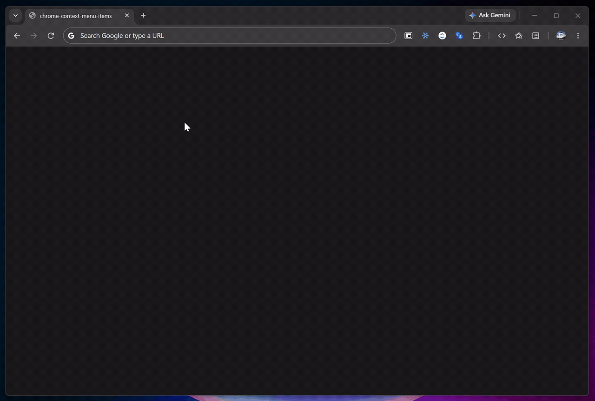
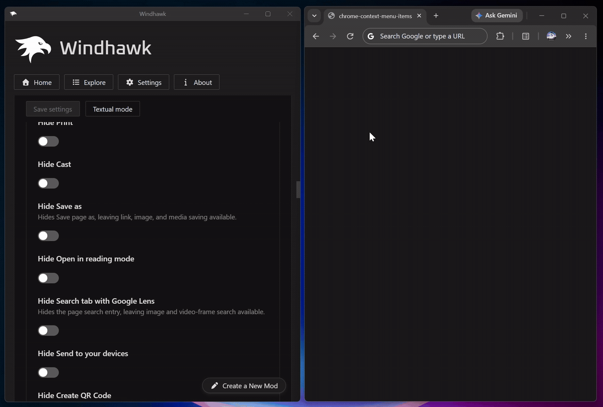
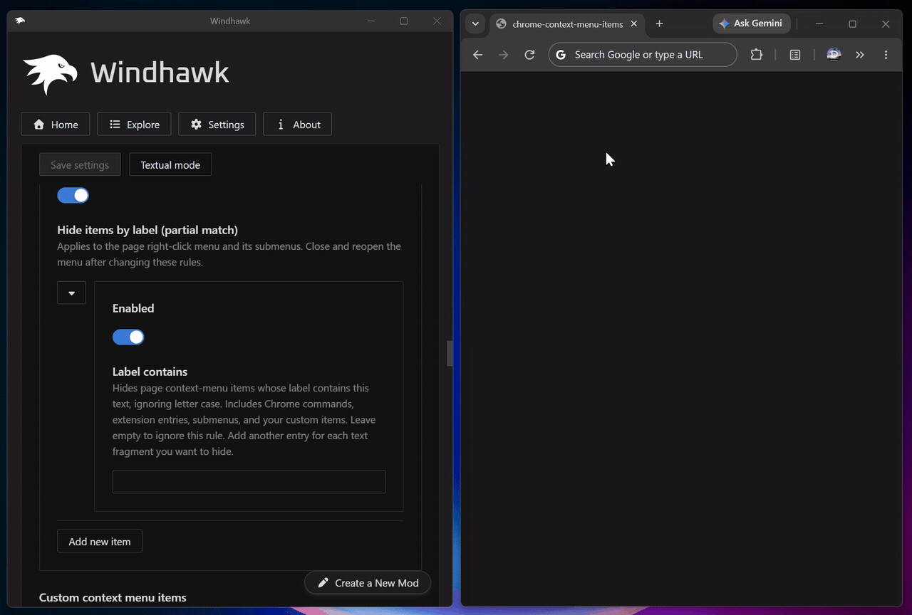
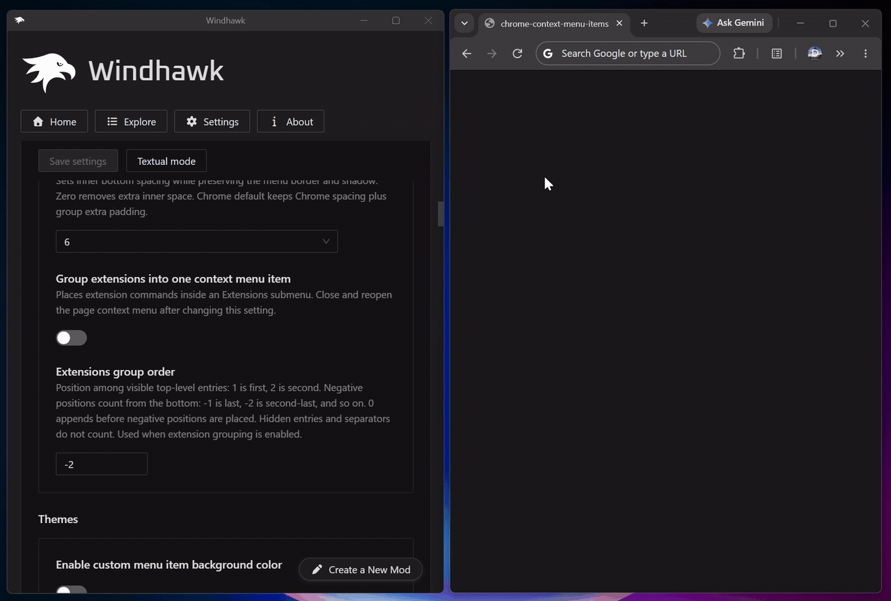

# Chrome Context Menu Items

Clean up and restyle **Google Chrome's menus**: hide the built‑in context menu
entries you never use, add your own commands, group extension entries into one
submenu, and change how menus, tabs and extension buttons look.

Designed for 64‑bit Chrome on Windows.

## Features

- **Hide built‑in items** — individually hide Ask Gemini, Print, Cast, Save page
  as, Open in reading mode, Search with Google Lens, Send to your devices, Create
  QR Code, Translate, Translate selection, View page source, Save link as, Open
  link in split view and Search image with Google Lens.
- **Hide by label** — hide any page menu entry whose label contains a piece of
  text, ignoring case. Works for Chrome commands, extension entries, submenus and
  your own items (up to 64 rules).
- **Custom commands** — add up to 64 entries to the page right‑click menu. Each
  one opens a program, document, folder or URL, with optional arguments, working
  directory and environment variables such as `%USERPROFILE%`, and can run as
  administrator or in a minimized, maximized or hidden window.
- **Custom items group** — optionally put your custom commands into one submenu
  with a label of your choice.
- **Extensions submenu** — move all extension commands into a single
  **Extensions** submenu, keeping their icons, submenus, checked states and
  actions.
- **Precise ordering** — place custom items, the Custom group and the Extensions
  submenu at an exact position: `1`, `2`, … from the top, `-1`, `-2`, … from the
  bottom, or `0` to append.
- **Menu appearance** — font size, item spacing, item corner radius, group
  padding, top / bottom spacing, custom background colors, background
  transparency and a custom group border.
- **Choose which menus to style** — page right‑click, the three‑dot menu, tab
  menus, bookmark menus and all other Chrome menus, each with their submenus.
- **Less clutter** — hide leading icons (everywhere, or only in the main page
  menu) and keyboard shortcut labels, without disabling the shortcuts.
- **Tabs and toolbar** — tab title font size, hidden tab close buttons, tab
  icon‑to‑title spacing and extension button width.
- **No 5 GB download on every update** — hook addresses are prepared once per
  Chrome build and saved (see [How it works](#how-it-works)).

## Screenshots

Hiding built‑in context menu items:

Hiding any item by its label, including extension entries:

Grouping extension commands into one Extensions submenu:

## Default configuration

Out of the box the mod:

* Styles all menu families with an item corner radius of 8, group padding of 4,
  top / bottom spacing of 6, 99% background opacity and a `#3b3b3b` group border.
* Hides Ask Gemini, Print, Cast, Save page as, Open in reading mode, Search with
  Google Lens, Send to your devices, Create QR Code, both Translate entries, Open
  link in split view and Search image with Google Lens. *View page source* and
  *Save link as* stay visible.
* Hides icons in the main page right‑click menu and keyboard shortcut labels.
* Groups extension commands into an **Extensions** submenu, second‑last.
* Adds no custom commands and leaves tabs and extension buttons at Chrome's
  defaults.

Everything is configurable in the mod settings. Use **Chrome default** or
disable an option to restore its normal behavior.

## How it works

The mod hooks Chrome's own menu code in `chrome.dll`: the page context menu
(`RenderViewContextMenu`) to hide, add, group and reorder entries, and the
shared Views menu classes to change fonts, spacing, colors and borders. Tab and
toolbar tweaks hook Chrome's tab and toolbar views.

These functions aren't exported, so their addresses normally come from Chrome's
debug symbols — a download of several gigabytes which changes with every Chrome
update. Instead, the mod first looks for the current build in its built‑in
address table and in the addresses it saved earlier. Only when the build is new
does it fall back to the symbols, then saves the result, so each Chrome build is
prepared at most once. Saved addresses are tied to the exact `chrome.dll` build
and validated before any hook is installed.

### Notes

Close and reopen menus after changing settings. Close open menus before updating
or disabling the mod.
