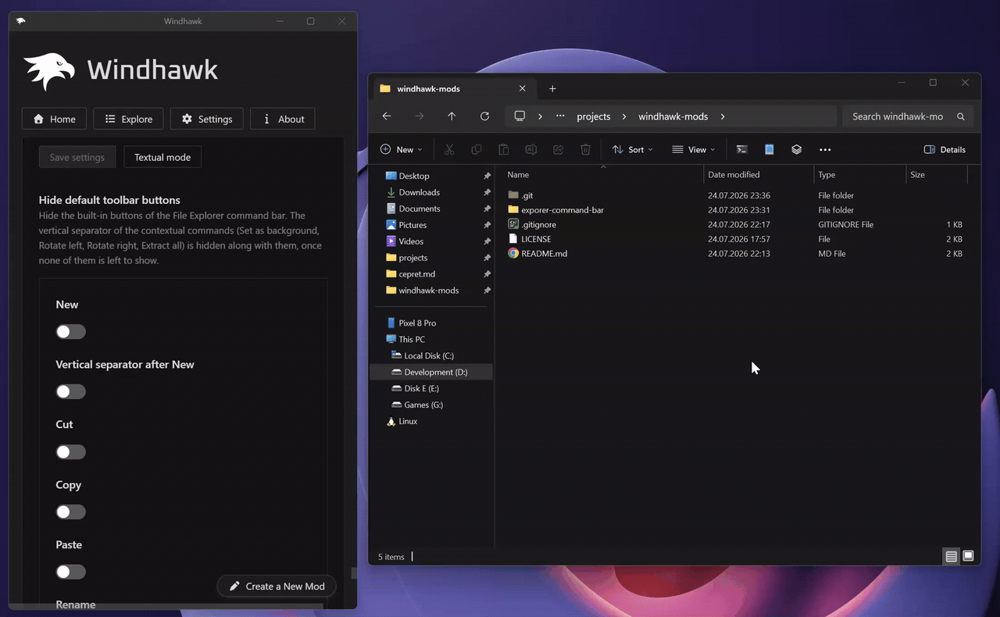

# Explorer Command Bar

Add your own buttons and dropdown menus to the **Windows 11 File Explorer
command bar** (the toolbar with New / Sort / View), and hide the built‑in
buttons, separators and spacing you don't want.

Designed for Windows 11 24H2 / 25H2 with the WinAppSDK (WinUI 3) File Explorer.

## Features

- **Custom buttons** — add as many toolbar buttons as you like, each running a
  command of your choice.
- **Dropdown menus & submenus** — a button can open a menu, and menu entries
  can themselves be submenus (three levels deep).
- **Path & selection placeholders** — `%path%` (active tab folder) and `%sel%`
  (selected file/folder) are substituted into the command parameters.
- **Flexible icons** — a Segoe Fluent Icons glyph, an `.exe` / `.dll` / `.ico`
  file, a Store‑app icon (`shell:AppsFolder\…`), the command executable's own
  icon, or no icon at all.
- **Hide built‑in elements** — individually hide New, Cut, Copy, Paste, Rename,
  Share, Delete, Sort, View, the group separators, the "See more" (…) overflow
  menu, the contextual commands (Set as background, Rotate left, Rotate right,
  Extract all) and the Details pane toggle.
- **Replace New with New+** — turn Explorer's New button into a *New+* button
  which creates files and folders from the templates of the
  [PowerToys **New+**](https://learn.microsoft.com/en-us/windows/powertoys/newplus)
  utility, with your own label and icon (see
  [Replace New to New+](#replace-new-to-new)).
- **Custom item spacing** — set the exact spacing between the command bar
  buttons, in pixels.
- **Open menus on hover** — optionally open dropdowns on hover, with a
  configurable delay. Applies to the New+ button as well.
- **Rock solid** — buttons are re‑applied automatically across tab switches,
  navigation, new tabs and new windows, and everything is cleanly restored when
  the mod is disabled.
- **Plays well with others** — no XAML Diagnostics, so the mod can be used
  together with **Windows 11 File Explorer Styler** and other tools which rely
  on it (see [How it works](#how-it-works)).

## Screenshots

Hiding built‑in buttons and separators:

You may hide even all options, and use only your custom ones:

## Command parameters

The following placeholders can be used in an item's parameters:

* `%path%` — the folder path of the currently active tab.
* `%sel%` — the full path of the selected file or folder in the active tab (the
  first one, if several are selected).

Wrap placeholders in quotes so paths with spaces work, e.g. `-d "%path%"`. If a
used placeholder has no value (nothing selected, or a non‑filesystem location
like *This PC*), the command is launched without any parameters. Commands run
with the active tab's folder as their working directory.

## Icons

The **Icon glyph or icon path** field accepts several forms:

* **A glyph** — a hex code point of a
  [Segoe Fluent Icons](https://learn.microsoft.com/en-us/windows/apps/design/iconography/segoe-fluent-icons-font)
  glyph, e.g. `E756`.
* **A file path** — an `.exe`, `.dll` or `.ico` file to take the icon from,
  optionally with an icon index, e.g. `C:\Windows\System32\shell32.dll,3`.
* **A Store app** — `shell:AppsFolder\<AppUserModelID>` to use a modern Store
  app's icon (useful for apps whose `.exe` stub carries a legacy icon, such as
  Notepad and Calculator).
* **Empty** — the icon is extracted from the command's executable (app
  execution aliases such as `wt.exe` are resolved to their real target).
* **Hide icon** — enable the toggle to show no icon at all.

## Replace New to New+

The **Replace New to New+** group turns Explorer's own **New** button into a
*New+* button: instead of Explorer's fixed list of file types, the dropdown lists
the templates of the
[PowerToys **New+**](https://learn.microsoft.com/en-us/windows/powertoys/newplus)
utility, and clicking one creates a copy of it in the current folder, selected and
ready to be renamed.

PowerToys is **not** required: the mod copies the templates itself and never talks
to the New+ shell extension. It only reads PowerToys' New+ settings file (if there
is one) to find the templates folder and the *Hide file extension* / *Hide starting
digits* / *Replace variables* options. Without PowerToys the New+ defaults are
used: templates are read from
`%LOCALAPPDATA%\Microsoft\PowerToys\NewPlus\Templates`, extensions and starting
digits are hidden, and variables are not replaced. Any folder can be used instead
via the **Templates folder** setting.

Every file and folder directly inside the templates folder becomes a menu entry
(hidden and system files, and `desktop.ini`, are skipped); a folder template is
copied with all of its contents. Folder templates are listed first, then files, in
the order File Explorer itself would list them, and if the name is already taken
` (2)`, ` (3)`, … is appended. The menu is built when it's opened, so templates
added or removed in the meantime show up without reloading anything.

The button takes the place of Explorer's New button, which is collapsed — the
**Keep Explorer's New button** toggle shows both side by side instead. Explorer's
own button is only ever hidden once the New+ button is really in that command bar,
so there is no moment in which neither of them is there. The **label** and the
**icon** are configurable:

* With a label, the familiar chevron (˅) is drawn after the text, exactly like
  Explorer's own New button.
* With the label turned off, or with an empty label, only the icon is shown, no
  chevron is drawn, and the text becomes the button's tooltip.
* An empty icon setting reuses the icon of Explorer's own New button; otherwise
  the same forms as in [Icons](#icons) are accepted.

### Filename variables

When *Replace variables* is enabled in PowerToys, these are substituted in the
name of the created copy:

| Variable | Meaning |
| --- | --- |
| `$YYYY` | Year, four digits |
| `$YY` | Year, two digits |
| `$MM` | Month, two digits |
| `$DD` | Day, two digits |
| `$hh` | Hour, two digits (24h) |
| `$mm` | Minute, two digits |
| `$ss` | Second, two digits |
| `$PARENT_FOLDER_NAME` | Name of the folder the item is created in |

Unlike New+, variables are replaced in the file *name* only, never inside the file
contents.

## Default configuration

Out of the box the mod adds:

* **Open in Terminal** — `wt.exe -d "%path%"`
* **Open in Notepad** — `notepad.exe "%sel%"`
* **Additional** ▾ (dropdown)
  * Open in VS Code — `code.exe "%path%"`
  * Open Paint — `mspaint.exe`
  * Open Calculator — `calc.exe`
  * **Commands** ▸ — `vite`, `npm init`, `npm install`, `npm run dev`,
    `npm run build`, `npm run start`
  * **AI** ▸ — `Claude`, `Codex`

All of the built‑in buttons stay visible by default, and the New+ button is
turned off. Everything is configurable in the mod settings.

## How it works

The mod hooks a couple of functions of File Explorer's own WinUI 3 code
(`FileExplorerExtensions.dll`) which run when the command bar is built, and finds
the command bars from there by walking the XAML tree with `VisualTreeHelper`. The
configured buttons are then inserted and the visibility / spacing settings are
applied. The mod also listens for the command bar being rebuilt so the buttons
stay in place across navigation, new tabs and new windows, and it restores the
original state of any element it touches when disabled.

The active tab's folder and selection are resolved through `IShellWindows` /
`IShellBrowser`, off the UI thread, so a slow or unresponsive shell can't block the
command bar.

### Compatibility

Notably, the mod does **not** use XAML Diagnostics
(`InitializeXamlDiagnosticsEx`). Only one XAML diagnostics consumer can be active
in a process at a time, so a mod which uses it stops working as soon as another
one is enabled. Avoiding it means this mod can be used together with:

* **Windows 11 File Explorer Styler**
* ExplorerBlurMica, TranslucentTB and similar tools
* UWPSpy and other XAML inspection tools

File Explorer windows which are already open when the mod is enabled are handled
too, but if the buttons don't show up in one of them right away, opening a new
tab or navigating to another folder makes them appear.
