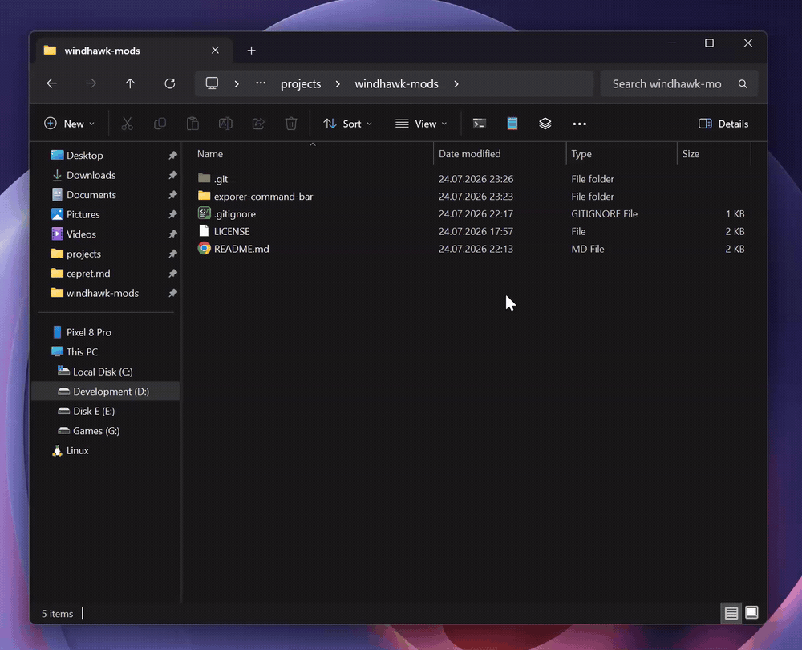
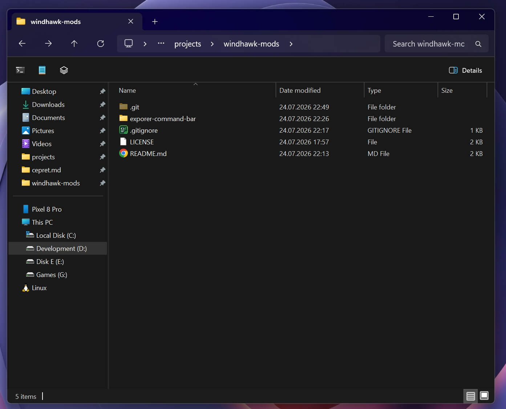

# Explorer Command Bar

Add your own buttons and dropdown menus to the **Windows 11 File Explorer
command bar** (the toolbar with New / Sort / View), and hide the built‑in
buttons, separators and spacing you don't want.

Designed for Windows 11 24H2 / 25H2 with the WinAppSDK (WinUI 3) File Explorer.

## Features

- **Custom buttons** — add as many toolbar buttons as you like, each running a
  command of your choice.
- **Dropdown menus & submenus** — a button can open a menu, and menu entries
  can themselves be submenus (three levels deep).
- **Path & selection placeholders** — `%path%` (active tab folder) and `%sel%`
  (selected file/folder) are substituted into the command parameters.
- **Flexible icons** — a Segoe Fluent Icons glyph, an `.exe` / `.dll` / `.ico`
  file, a Store‑app icon (`shell:AppsFolder\…`), the command executable's own
  icon, or no icon at all.
- **Hide built‑in elements** — individually hide New, Cut, Copy, Paste, Rename,
  Share, Delete, Sort, View, the group separators, the "See more" (…) overflow
  menu, the contextual commands (Set as background, Rotate left, Rotate right,
  Extract all) and the Details pane toggle.
- **Custom item spacing** — set the exact spacing between the command bar
  buttons, in pixels.
- **Open menus on hover** — optionally open dropdowns on hover, with a
  configurable delay.
- **Rock solid** — buttons are re‑applied automatically across tab switches,
  navigation, new tabs and new windows, and everything is cleanly restored when
  the mod is disabled.

## Screenshots

Hiding built‑in buttons and separators:

You may hide even all options, and use only your custom ones:

## Command parameters

The following placeholders can be used in an item's parameters:

* `%path%` — the folder path of the currently active tab.
* `%sel%` — the full path of the selected file or folder in the active tab (the
  first one, if several are selected).

Wrap placeholders in quotes so paths with spaces work, e.g. `-d "%path%"`. If a
used placeholder has no value (nothing selected, or a non‑filesystem location
like *This PC*), the command is launched without any parameters. Commands run
with the active tab's folder as their working directory.

## Icons

The **Icon glyph or icon path** field accepts several forms:

* **A glyph** — a hex code point of a
  [Segoe Fluent Icons](https://learn.microsoft.com/en-us/windows/apps/design/iconography/segoe-fluent-icons-font)
  glyph, e.g. `E756`.
* **A file path** — an `.exe`, `.dll` or `.ico` file to take the icon from,
  optionally with an icon index, e.g. `C:\Windows\System32\shell32.dll,3`.
* **A Store app** — `shell:AppsFolder\<AppUserModelID>` to use a modern Store
  app's icon (useful for apps whose `.exe` stub carries a legacy icon, such as
  Notepad and Calculator).
* **Empty** — the icon is extracted from the command's executable (app
  execution aliases such as `wt.exe` are resolved to their real target).
* **Hide icon** — enable the toggle to show no icon at all.

## Default configuration

Out of the box the mod adds:

* **Open in Terminal** — `wt.exe -d "%path%"`
* **Open in Notepad** — `notepad.exe "%sel%"`
* **Additional** ▾ (dropdown)
  * Open in VS Code — `code.exe "%path%"`
  * Open Paint — `mspaint.exe`
  * Open Calculator — `calc.exe`
  * **Commands** ▸ — `vite`, `npm init`, `npm install`, `npm run dev`,
    `npm run build`, `npm run start`
  * **AI** ▸ — `Claude`, `Codex`

All of the built‑in buttons stay visible by default. Everything is configurable
in the mod settings.

## How it works

The mod injects a XAML diagnostics provider into Explorer and watches the WinUI
3 visual tree for the File Explorer command bar. When it appears, the configured
buttons are inserted and the visibility / spacing settings are applied. The mod
listens for the command bar being rebuilt so the buttons stay in place across
navigation, new tabs and new windows, and it restores the original state of any
element it touches when disabled.
